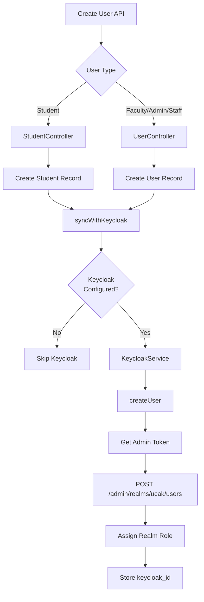
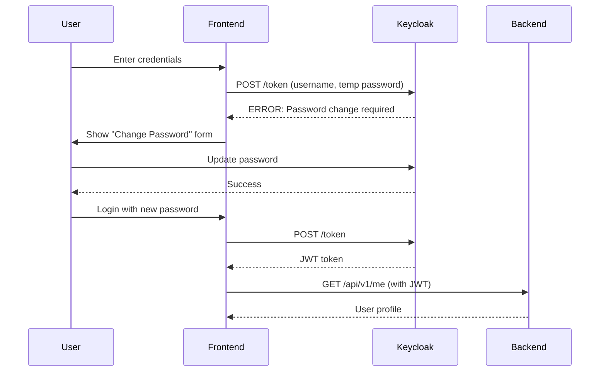

# User Creation Flow with Keycloak Integration

## Overview

This document explains how users are created in the system with automatic Keycloak synchronization.

## User Creation Methods

### 1. **Auto-Creation on Login** (Existing)

**Flow**: User logs in via Keycloak → Backend auto-creates User record

**Implementation**: `KeycloakUserProvider::retrieveByKeycloakToken()`

**When to use**: Users already exist in Keycloak (manually created by admin)

```php
// Automatic - happens on first login
// 1. User logs in via Keycloak frontend
// 2. Frontend sends JWT to backend API
// 3. KeycloakUserProvider creates/updates User in database
// 4. Roles synced from Keycloak → Spatie permissions
```

---

### 2. **Student Creation** (Existing)

**Flow**: Create Student profile → Auto-create Keycloak user if needed

**Endpoint**: `POST /api/v1/students`

**Implementation**: `StudentController::store()` + `syncWithKeycloak()`

```json
POST /api/v1/students
{
  "user_id": "uuid",
  "full_name": "John Doe",
  "gender": "M",
  "date_of_birth": "2000-01-01",
  ...
}
```

**What happens**:
1. Creates Student record with auto-generated student number (UCAK2026001)
2. Checks if User has Keycloak account
3. If not, creates Keycloak user with:
   - Username: Student number
   - Password: Temporary (must change on first login)
   - Role: STUDENT
4. Links `student.keycloak_user_id` and `user.keycloak_id`

---

### 3. **General User Creation** ✨ **NEW** - Faculty/Admin/Staff

**Flow**: Create User → Auto-create Keycloak account with role

**Endpoint**: `POST /api/v1/admin/users`

**Implementation**: `UserController::store()` (newly created)

```json
POST /api/v1/admin/users
{
  "email": "prof.smith@ucak.sn",
  "role": "FACULTY",
  "full_name": "Prof. John Smith",
  "employee_number": "FAC2026001",
  "temporary_password": "Welcome123!",
  "is_active": true
}
```

**What happens**:
1. Creates local User record
2. Assigns role locally (Spatie)
3. Creates Keycloak user with:
   - Username: employee_number or email_prefix
   - Email: user email
   - Password: Temporary (must change on first login)
   - Role: FACULTY/ADMIN/STAFF
4. Stores `keycloak_id` in User table

---

## Keycloak Integration Architecture



---

## KeycloakService Methods

### **createUser(array $data): ?string** ✨ **NEW**

Generic method for creating any user type.

```php
$keycloakUserId = $keycloakService->createUser([
    'username' => 'prof.smith',
    'email' => 'prof.smith@ucak.sn',
    'first_name' => 'John',
    'last_name' => 'Smith',
    'temporary_password' => 'Welcome123!',
    'enabled' => true,
    'email_verified' => false,
    'password_temporary' => true,
]);
```

### **createStudentUser(array $data): ?string**

Specialized method for students (calls `createUser()` + assigns STUDENT role).

```php
$keycloakUserId = $keycloakService->createStudentUser([
    'username' => 'UCAK2026001',
    'email' => 'student@ucak.sn',
    'first_name' => 'John',
    'last_name' => 'Doe',
]);
// Automatically assigns STUDENT role
```

### **assignRealmRole(string $userId, string $roleName): bool**

Assigns a role to an existing Keycloak user.

```php
$keycloakService->assignRealmRole($keycloakUserId, 'FACULTY');
```

---

## User Types & Creation Endpoints

| User Type | Endpoint | Controller | Creates Keycloak User | Role Assigned |
|-----------|----------|------------|-----------------------|---------------|
| **Student** | `POST /api/v1/students` | StudentController | ✅ Yes | STUDENT |
| **Faculty** | `POST /api/v1/admin/users` | UserController | ✅ Yes | FACULTY |
| **Admin** | `POST /api/v1/admin/users` | UserController | ✅ Yes | ADMIN |
| **Staff** | `POST /api/v1/admin/users` | UserController | ✅ Yes | STAFF |

---

## Configuration Required

### Development (.env.docker)

```env
# Keycloak Admin API
KEYCLOAK_ADMIN_API_ENABLED=true
KEYCLOAK_ADMIN_CLIENT_ID=admin-cli
KEYCLOAK_ADMIN_USERNAME=admin
KEYCLOAK_ADMIN_PASSWORD=admin
KEYCLOAK_DEFAULT_TEMPORARY_PASSWORD=ChangeMe123!
```

### Production (.env)

```env
# Keycloak Admin API
KEYCLOAK_ADMIN_API_ENABLED=true
KEYCLOAK_ADMIN_CLIENT_ID=backend-admin-api
KEYCLOAK_ADMIN_CLIENT_SECRET=your-secret-here
KEYCLOAK_DEFAULT_TEMPORARY_PASSWORD=Welcome@UCAK2026
```

---

## First Login Flow

After user creation via API:



---

## Testing User Creation

### Test Faculty Creation

```bash
curl -X POST http://localhost:8000/api/v1/admin/users \
  -H "Authorization: Bearer $ADMIN_TOKEN" \
  -H "Content-Type: application/json" \
  -d '{
    "email": "test.faculty@ucak.sn",
    "role": "FACULTY",
    "full_name": "Test Faculty",
    "employee_number": "FAC2026TEST",
    "temporary_password": "Welcome123!"
  }'
```

### Verify in Keycloak

1. Login to Keycloak Admin: https://auth.ucak.sn
2. Go to **Users** → Search for "test.faculty@ucak.sn"
3. Check:
   - ✅ User exists
   - ✅ Email is set
   - ✅ Role: FACULTY assigned
   - ✅ Password is temporary

### Test First Login

```bash
curl -X POST https://auth.ucak.sn/realms/ucak/protocol/openid-connect/token \
  -d "client_id=ccak-backend" \
  -d "grant_type=password" \
  -d "username=FAC2026TEST" \
  -d "password=Welcome123!"
```

**Expected**: Password update required error

---

## Error Handling

### Graceful Degradation

If Keycloak is unavailable:
- ✅ User is still created locally
- ⚠️ Warning logged
- ✅ API returns success (201)
- 💡 Admin can manually create Keycloak user later

### Duplicate Prevention

- Email uniqueness enforced at database level
- Keycloak username uniqueness checked
- If Keycloak creation fails, local user creation rolls back

---

## Files Created/Modified

### New Files

- ✅ `app/Http/Controllers/Admin/UserController.php` - User CRUD with Keycloak sync
- ✅ `app/Http/Requests/Admin/StoreUserRequest.php` - User creation validation

### Modified Files

- ✅ `app/Services/Auth/KeycloakService.php` - Added generic `createUser()` method

### Routes to Add

```php
// In routes/api.php
Route::prefix('admin')->middleware(['auth:api', 'role:ADMIN'])->group(function () {
    Route::post('users', [UserController::class, 'store']);
    Route::get('users', [UserController::class, 'index']);
    Route::get('users/{user}', [UserController::class, 'show']);
    Route::put('users/{user}', [UserController::class, 'update']);
    Route::delete('users/{user}', [UserController::class, 'destroy']);
});
```

---

## Security Best Practices

1. ✅ **Temporary Passwords**: Always force password change on first login
2. ✅ **Role Assignment**: Both local (Spatie) and Keycloak roles assigned
3. ✅ **Admin-Only Access**: User creation restricted to ADMIN role
4. ✅ **Audit Logging**: All user creations logged
5. ✅ **Email Verification**: Keycloak handles email verification workflow

---

## Summary

✅ **Students**: Use `POST /api/v1/students` (creates Student profile + Keycloak user)

✅ **Faculty/Admin/Staff**: Use `POST /api/v1/admin/users` (creates User + Keycloak user)

✅ **Auto-Login**: All methods automatically create Keycloak accounts

✅ **Graceful Failure**: If Keycloak unavailable, users still created locally

---

**Ready for production!** 🚀
